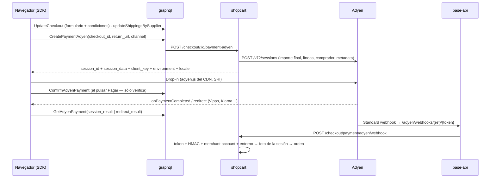

# Adyen en Vio Commerce

Quinto proveedor de pago. Escrito el 2026-09-17 leyendo la documentación de Adyen de punta a
punta antes de escribir código ([fuentes](#fuentes)). Las decisiones están en
[ADR-0019](../decisions/0019-adyen-sesiones-form-first.md); el contexto común a todos los
proveedores, en [`payments.md`](./payments.md).

> **Estado al 2026-09-17:** implementado en ramas `feature/adyen-payment` de ocho repos,
> **sin pushear y sin probar contra Adyen** (la credencial de test se creó ese mismo día). Ver
> el [journal](../journal/2026-09/2026-09-17-adyen-analisis-e-implementacion.md).

## Adyen no es un Qliro ni un Nexi

| | Kustom / Qliro / Walley / Nexi | **Adyen** |
|---|---|---|
| Qué es | Checkout embebido: pide email, dirección (Qliro, el envío) y cobra | **Capa de pago**: Drop-in lista métodos y cobra |
| Email, teléfono, dirección | Los pide el widget | **No los pide.** Los pide el formulario de Vio y viajan en la sesión |
| Envío | Qliro dentro; Nexi fuera | Fuera (el selector de Vio). Dentro de Adyen sólo en Apple Pay / Google Pay / PayPal express |
| Aviso del pago | Por pago (Nexi) o URL por orden (Qliro) | **Sólo a nivel de cuenta.** Varios endpoints, cada uno con su HMAC y su cola |
| Claves | Dos | API key + client key (con *allowed origins*) + merchant account + prefijo live + HMAC |
| Recibo | Qliro y Walley, el suyo; Nexi, el nuestro | El nuestro |
| Clientes | Sólo web | El mismo `POST /sessions` sirve a Web, iOS, Android, React Native y Flutter |

En el SDK web eso significa que `adyen` **no está** en `EMBEDDED_METHODS`: va en
`FORM_FIRST_WIDGET_METHODS` (el formulario de entrega se queda) y en
`NO_EXPRESS_BUTTON_METHODS` (una página que sólo ofrece Adyen necesita el "Kjøp nå" genérico).

## El flujo

1. **Formulario primero.** El SDK guarda email, direcciones y condiciones aceptadas
   (`UpdateCheckout`) y el envío elegido. Sin checkout activo, sin envío elegido o sin dirección
   de entrega, shopcart **rechaza** la sesión (`ADYEN_CHECKOUT_REQUIRED`,
   `ADYEN_SHIPPING_REQUIRED`, `ADYEN_ADDRESS_REQUIRED`).
2. **La sesión se crea con el importe final**, que es la **suma de las líneas** (el envío es una
   línea más). Nunca un total flotante calculado aparte: Klarna rechaza si no cuadra.
3. **La foto** (`AdyenCheckoutMeta`) queda en `checkout.origin_payment_body`: sesión, referencia,
   **qué cuenta cobra** (`seller` / `platform` + merchant account), entorno, market, importe,
   líneas, envío y comprador tal como estaban. Guarda hasta dos fotos de sesiones reemplazadas.
4. **La sesión sólo se monta cuando el comprador la pide** (elige el método o pulsa "Gå til
   betaling") y con el formulario completo. Un cambio de formulario, envío o carrito **baja** el
   Drop-in; no se parchea ni se recrea solo.
5. **Al pulsar Pagar**, `ConfirmAdyenPayment` comprueba que esa sesión es la vigente y que
   carrito y total siguen iguales. `ok: false` (`SESSION_REPLACED`, `AMOUNT_CHANGED`,
   `CART_CHANGED`, `ALREADY_PAID`) detiene a Adyen. Un doble envío (Enter + click) se rechaza.
6. **El resultado que se muestra es el que Adyen le da al backend** (`GET /sessions/{id}` o
   `POST /payments/details`), nunca el del navegador. `pending` (Swish, Trustly) promete el
   email y conserva el carrito; lo desconocido nunca es "pague de nuevo".
7. **El webhook crea la orden.** Se autentica por token de URL + HMAC (clave actual y anterior)
   + merchant account + entorno. La orden se arma desde la foto de **esa** sesión, bajo un lock
   de MySQL con el nombre del checkout, y si no se puede guardar **lanza**: Adyen reintenta
   hasta 30 días. Un pago que no coincide con ninguna foto se acepta sin orden y deja
   `[ADYEN_PAYMENT_MISMATCH]` en el log, para reembolsar a mano.
8. **Sweep.** Adyen no tiene "leer este pago". Lo que cubre es el webhook **no configurado**: una
   sesión cuyo `Authorised` Adyen ya nos confirmó y que sigue sin orden a los 15 minutos
   (`[ADYEN_WEBHOOK_MISSING]`).

### La vuelta de un redirect

Vipps, Klarna, Trustly y el 3DS por redirect salen de la página. El `returnUrl` es **la misma
página** con `vio_payment=return&vio_method=adyen&vio_sponsor=…&checkout_id=…`; Adyen añade
`sessionId` y `redirectResult`. Al volver, el SDK limpia la query **antes que nada** (un reload
no reenvía un `redirectResult` usado), finaliza en el servidor y muestra la confirmación. No usa
`sessionStorage`, así que funciona aunque el comprador vuelva en otro navegador (in-app de una
app de noticias → Safari), y sin `redirectResult` no se retoma nada — el defecto de Nexi 0.12.2
no tiene por dónde repetirse. Una URL de más de 1024 caracteres pierde su propia query, no el pago.

## Credenciales

Fila `payment_method` con `options` (string JSON), `name: 'Adyen'`:

| Campo | |
|---|---|
| `apiKey` | Secreta, cifrada. Developers → API credentials → Server settings |
| `clientKey` | Pública, va al navegador. **Decide el entorno** (`test_` / `live_`) |
| `merchantAccount` | La cuenta **merchant** donde liquida (sensible a mayúsculas; no la company) |
| `merchantAccounts` | Opcional: `{ "SE": "AcmeSE" }`, una merchant account por market |
| `liveUrlPrefix` | Sólo live: `1797a841fbb37ca7-Empresa` (Developers → API URLs) |
| `hmacKey`, `hmacKeyPrevious` | Secretas. La del webhook, y la anterior mientras rota |
| `webhookToken` | **La gestiona el servidor**: se genera al guardar la fila y se conserva en cada edición |
| `captureMode` | `account` (default: manda la cuenta) · `immediate` · `manual` |
| `shopperStatement` | ≤ 22 caracteres; es lo que se lee en la app de Vipps |
| `forceRedirect3ds`, `blockedPaymentMethods` | Opcionales |

**Cuenta de plataforma** (seller sin fila de Adyen): `ADYEN_API_KEY`, `ADYEN_CLIENT_KEY`,
`ADYEN_MERCHANT_ACCOUNT`, `ADYEN_HMAC_KEY`, `ADYEN_HMAC_KEY_PREVIOUS`, `ADYEN_WEBHOOK_TOKEN`,
`ADYEN_SHOPPER_STATEMENT` y, en producción, `ADYEN_LIVE_URL_PREFIX`, en el `.env` compartido.
El api sólo necesita `ADYEN_API_KEY` (para saber que hay fallback).

**Verify** (`POST /paymentmethod/verify`): `POST /paymentMethods {merchantAccount}` en el entorno
de la client key. Cada rechazo dice su causa: 401 = la API key no es de ese entorno; 403/901 =
merchant account; 403/010 = falta el rol *Checkout webservice*; una client key live sin prefijo
se rechaza antes de llamar a Adyen.

**Dónde se ofrece** (`adyen-offer.ts`): interruptor `adyen` del canal encendido **y** alguien que
cobre (seller o plataforma) **y** el canal vende en un market habilitado. Un canal sin fila de
settings **no** recibe Adyen por defecto, a diferencia de los métodos antiguos.

### El webhook, en la cuenta del seller

`{API_HOST}/adyen/webhooks/{ref}/{token}`, con `ref` = `platform` o el id de la fila. El seller
lo registra una vez en su Customer Area (Developers → Webhooks → Standard webhook, JSON, eventos
por defecto + `OFFER_CLOSED`), genera la clave HMAC y la pega en el dashboard, que muestra la URL
y avisa mientras falta. Reglas de Adyen que el relay respeta: 2xx en 10 s (el relay corta a 9 s),
reintentos hasta 30 días, **un evento que falla bloquea la cola de ese endpoint**, sin garantía
de orden, duplicados por `eventCode` + `pspReference`. El cuerpo nunca se loguea.

## Markets

Un market en Vio es un código de país: el catálogo global (`/channel/markets/availables`) dice
dónde vende Vio, `channel_user_settings.markets` dónde vende el canal, y la moneda vive en el
carrito. Adyen filtra sus métodos por el par `countryCode` + moneda (Vipps exige NO + NOK; Swish,
SE + SEK), así que `resolveAdyenMarket` rechaza antes de llamar a Adyen: `MARKET_NOT_AVAILABLE`,
`MARKET_NOT_IN_CHANNEL`, `MARKET_NOT_ENABLED`, `MARKET_CURRENCY_MISMATCH`. Habilitados hoy:
**`NO`**. ⚠️ El noruego en Adyen Web es `no-NO`; `nb-NO` cae a inglés sin avisar.

## Métodos para los nórdicos

| Método | País · moneda | Flujo | Captura separada | Resultado |
|---|---|---|---|---|
| Tarjetas (3DS2 nativo) | — | campos embebidos | sí (por defecto inmediata) | síncrono |
| Vipps | NO · NOK | redirect → app | sí | al volver; webhook confirma |
| Swish | SE · SEK | QR en desktop, app en móvil | **no** | **siempre `Pending`**, 3 minutos |
| Klarna: later / over time / now | NO sin *pay now*; SE las tres | redirect o widget | **manual, ≤ 90 días** | `Pending` con widget |
| Trustly | DKK, EUR, NOK, SEK | redirect | no | `Pending`; **fondos no garantizados** (contracargo a los 8 días) |
| MobilePay | DK, FI | redirect → app | sí | **sin entorno de test** |
| Walley | DK, FI, NO, SE | redirect | sí, ≤ 90 días | sólo vía soporte de Adyen |
| Apple Pay / Google Pay | — | hoja del wallet | sí | Apple Pay web: archivo de asociación en **cada** dominio |

BankAxept online **no existe** en Adyen (sólo presencial). Riverty no cubre los nórdicos.

### Datos de prueba (cuenta TEST, 2026-09-22)

- **Métodos activos para NO/NOK:** según `/paymentMethods`, `scheme`, `klarna`, `klarna_account`,
  `vipps`, `trustly` y `paysafecard`.
- **Tarjetas:** caducidad `03/30`, CVC `737`; Amex, `7373`.
  - Sin reto: Visa `4111 1111 1111 1111` y Mastercard `5555 3412 4444 1115`.
  - Inscritas en 3DS2, así que **piden reto**: Visa `4917 6100 0000 0000`, Mastercard
    `5454 5454 5454 5454` y Amex `3714 4963 5398 431`.
- **Reto 3DS2 en web:** la contraseña `password` autentica. Cualquier otra lo hace fallar, y es la
  única forma de provocar un rechazo desde nuestro Drop-in. Sin el campo del titular
  (`hasHolderName`), los valores de rechazo de Adyen en el nombre no se pueden usar.
- **Paysafecard:** código `0000 0000 0990 3417`.
- **Trustly:** cualquier número con el formato `AAMMDD-XXXX`, en su banco de test.
- **Klarna:** los datos de prueba de Klarna para Adyen.
- **Vipps:** la app de test de Vipps MT, con NIN `14103524416`, teléfono `+47 99985255` y código
  `1236`.
- **Guía para QA:** tarjeta de Alan [kk5Qv6cv](https://trello.com/c/kk5Qv6cv).

## Qué le llega al vendedor

- **En su Adyen:** `reference` = id del checkout, `merchantOrderReference`, comprador y
  direcciones, líneas con **su** identificador (`g:id` del feed, si no SKU) y URL del producto,
  `shopperStatement`, y `metadata.vio_checkout | vio_seller | vio_channel | vio_channel_name |
  vio_market | vio_account | vio_client` (máx. 20 pares, clave ≤ 20, valor ≤ 80).
- **Por su propio segundo webhook** (lo configura él): pago, comprador, direcciones y
  `metadata.*`, activando *Include Shopper Details*, *Include Delivery Address*, *Include Avs
  Data* e *Include Metadata in payment webhook for 3D Secure payments*.
- **Por nuestro `order.paid`:** las líneas. Adyen **no las devuelve nunca**, ni en webhooks ni
  en reportes; se unen por `reference` / `pspReference` (en la orden: `channelId`).

## Lo que queda

1. Spike contra TEST (`~/vio-commerce/tools/adyen-spike`): `payable:false`, fuga de CSS del
   publisher sobre el Drop-in en light DOM, vuelta de Vipps, qué ve el seller en su Customer Area.
2. Auto-configuración por Management API: `GET /me`, `GET /merchants`, `livePrefix`,
   `POST /me/allowedOrigins`, webhook + `generateHmac` + `test`.
3. Captura, refund y cancel por API, y sincronizar `CAPTURE` / `REFUND` / `CHARGEBACK`.
4. `order.paid` con reintentos durables y payload enriquecido.
5. Express wallets, SDKs nativos (`channel` y `return_url` ya viajan), OAuth de partner.

## Fuentes

Leídas el 2026-09-17. `docs.adyen.com` sirve cada página como Markdown con `.md` al final, y los
OpenAPI están en `github.com/Adyen/adyen-openapi` (ver
[la lección](../lessons/leer-la-doc-del-psp-cruda.md)).

- [Sessions flow](https://docs.adyen.com/online-payments/build-your-integration/sessions-flow/) ·
  [buenas prácticas web](https://docs.adyen.com/online-payments/web-best-practices) ·
  [upgrade a v72](https://docs.adyen.com/online-payments/upgrade-your-integration/upgrade-to-checkout-api-v72)
- [Client key y allowed origins](https://docs.adyen.com/development-resources/client-side-authentication) ·
  [live endpoints](https://docs.adyen.com/development-resources/live-endpoints)
- [Webhooks](https://docs.adyen.com/development-resources/webhooks) ·
  [HMAC](https://docs.adyen.com/development-resources/webhooks/secure-webhooks/verify-hmac-signatures) ·
  [Management API](https://docs.adyen.com/api-explorer/Management/latest/overview)
- [Express checkout](https://docs.adyen.com/payment-methods/express-checkout) ·
  [captura](https://docs.adyen.com/online-payments/capture) ·
  [Vipps](https://docs.adyen.com/payment-methods/vipps/) ·
  [Swish](https://docs.adyen.com/payment-methods/swish/) ·
  [Klarna](https://docs.adyen.com/payment-methods/klarna/) ·
  [Trustly](https://docs.adyen.com/payment-methods/trustly/)
- [Partners: checklist](https://docs.adyen.com/partners/integration-checklist) ·
  [OAuth](https://docs.adyen.com/partners/oauth) ·
  [application info](https://docs.adyen.com/partners/application-information)
