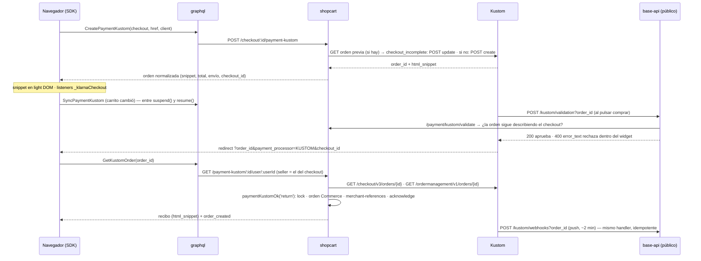

# Kustom Checkout en Vio Commerce

Kustom es Klarna Checkout v3 (KCO) con dueño nuevo: la misma API (`POST /checkout/v3/orders`
→ `html_snippet`), los mismos callbacks, la misma API JS del widget (`window._klarnaCheckout`)
y hosts propios (`api.kustom.co` / `api.playground.kustom.co`). Es un **checkout embebido**: el
widget pide dirección, envío y pago. Vio pone la orden (líneas, importes, tarifas de envío,
URLs) y recibe el pago por dos caminos que corren el mismo código.

Estado: código terminado y probado en unitario el 2026-09-18 (rama `feature/kustom-checkout`
en seis repos, ver [journal](../journal/2026-09/2026-09-18-kustom-terminar-integracion.md));
**sin probar contra el playground** porque el MID de test no tiene ningún país configurado.
Decisiones en [ADR-0020](../decisions/0020-kustom-una-orden-por-checkout.md).

## Lo que Kustom es y no es

| | Kustom |
|---|---|
| Qué pide el widget | Email, dirección de facturación, dirección de envío (`allow_separate_shipping_address`), tarifa de envío (de la lista que mandamos o del KSA del seller), método de pago |
| Importes | **Enteros en unidades menores**; `tax_rate` en puntos base (2500 = 25 %); `total_tax_amount` a ±1 de `total − total × 10000 / (10000 + tax_rate)`; `order_amount` = Σ líneas |
| Envío | Lo elige el comprador **dentro del widget** de la lista `shipping_options` (la primera va preseleccionada). Kustom **añade la línea `shipping_fee` al completar**: los totales que mandamos son de la mercancía |
| Sesión | La orden vive 48 h y **se actualiza en su sitio** (`POST /checkout/v3/orders/{id}`) entre `suspend()` y `resume()`. Nunca una orden nueva por un cambio de carrito |
| Callbacks (por orden, en `merchant_urls`) | `checkout`, `confirmation` (redirect del comprador), `push` (servidor, ~2 min después, reintentos 48 h hasta `acknowledge`), `validation` (al pulsar comprar, 3 s, fail-open) |
| Verdad post-compra | **Order Management** (`GET /ordermanagement/v1/orders/{id}`): `status` AUTHORIZED / PART_CAPTURED / CAPTURED / CANCELLED / EXPIRED / CLOSED y `fraud_status`. Un pedido que OM no conoce (404) no está pagado |
| Credenciales | Por seller, `kco_(test|live)_api_…`; el entorno sale del prefijo. **Sin fallback de plataforma** (decisión 2026-08-28): el dinero cae en la cuenta de Kustom del seller o el método no aparece |
| Markets | `purchase_country` + `purchase_currency` deben estar configurados en el MID del seller; Vio además aplica su limitación (catálogo ∩ markets del canal ∩ `KUSTOM_ENABLED_MARKETS = ['NO']`) |
| Métodos en Noruega | Los que Kustom tenga activos en el MID (tarjeta, factura/financiación Klarna, Vipps si está contratado); Vio no los elige |
| Captura | `options.auto_capture` (default `true` en Vio). Captura/refund por API quedan pendientes, como con los demás embebidos |

## El flujo

## Backend (shopcart)

- `providers/kustom-lines.ts` — puro: `kustomMinor`, `kustomTaxRate`, `kustomTaxAmount` (la fórmula
  de Kustom), `buildKustomLine`, `buildKustomDiscountLine` (IVA negativo), `buildKustomShippingOption`,
  `dominantTaxRate` (el IVA de la línea que más pesa, para la tarifa), `goodsAmount`, `kustomStatus`.
- `providers/kustom-market.ts` — la limitación por market; Noruega primero; locale `nb-NO`.
- `providers/kustomConnector.service.ts` — Checkout API (create / read / update) y Order Management
  (read, `acknowledge`, `merchant-references`) con `Klarna-Idempotency-Key` determinista
  (`kustomIdempotencyKey`). Auth `Basic <kco_key>` (verificado: Kustom acepta la key cruda,
  `base64(user:key)` y `base64(:key)`).
- `providers/kustom.service.ts` — `createOrUpdateOrder` (foto en `origin_payment_body` como
  `KustomCheckoutMeta`: importe de mercancía, líneas, tarifas, versión, ids de órdenes reemplazadas),
  `buildPayload` (`merchant_reference1` = checkout, `merchant_data` con `vio_*`, `validation` sólo con
  `API_HOST` https, colores del tema), `matchesMeta`, `normalize`, `settle`.
- `checkout.service.ts` — `paymentKustomOk(orderId, source)` bajo `withCheckoutLock`; `getPaymentKustom`
  / `getPaymentKustomByOrder` (completan al leer si Kustom dice `checkout_complete`);
  `validateKustomOrder`; el barrido `reconcileEmbeddedPayments` usa el mismo handler.
- `cart.service.ts` — `initPaymentKustom` (crea el checkout si falta, tarifas por
  `QliroService.resolveShippingChoices`, descuentos como líneas), `syncPaymentKustom`.
- Endpoints: `POST /checkout/:id/payment-kustom`, `POST /checkout/:id/payment-kustom/sync`,
  `GET /checkout/:id/payment-kustom`, `GET /checkout/payment-kustom/:id/user/:userId` (ruta antigua,
  seller ignorado), `POST /checkout/payment/kustom/push`, `POST /checkout/payment/kustom/validate`,
  y `/pre` + `/ok` para el relay antiguo.
- Config: `KUSTOM_TERMS_URL` (términos de plataforma cuando el seller no puso los suyos; WARN),
  `KUSTOM_API_URL` sólo como override.

**base-api**: `POST /kustom/webhooks?order_id=` → shopcart `/push`, **estado pasado tal cual**
(un fallo es 5xx y Kustom reintenta); `POST /kustom/validation?order_id=` → `/validate` → 200 o
400 `{error_type, error_text}`; sin respuesta = aprobado (fail-open, como Kustom a los 3 s).

**graphql**: `CreatePaymentKustom`, `GetKustomOrder` devuelven `KustomOrderDTO` (normalizado:
nunca la orden cruda con los datos del comprador); `SyncPaymentKustom(checkout_id)` nuevo.

**api**: `kustom-offer.ts` — interruptor del canal + clave del seller + market habilitado.

## SDK (`vio-web-sdk` 0.14.0)

- `payments/kustom.ts`: documentos GraphQL, `renderKustomSnippet` (re-crea los `` cierra el nuestro. El SDK no se ve
  afectado, porque lo mete por `innerHTML`.

## Pendiente
- E2E en el playground: tarjeta `4242…`, 3DS `4000002760003184`, cambio de tarifa dentro del
  widget, cambio de carrito con el widget abierto (sync), cierre y reapertura (¿re-inicializar el
  snippet sin recargar rompe algo? Kustom lo desaconseja), validación rechazada, push sin
  `acknowledge`, orden con captura automática en el portal.
- Captura/refund/cancel por API (payment-processors sólo conoce Klarna); estado de la orden Commerce
  cuando Kustom captura o cancela.
- `order.paid` al ecommerce del seller: el genérico; Kustom no tiene URL de aviso propia.
- Kustom Elements (express buttons) exige KSA; fuera de alcance.
- **Native Partner Onboarding API** de Kustom (crear merchants, credenciales y widget de KYC desde
  Vio): el "conecta tu Kustom" sin copiar claves; requiere acuerdo de partner.
