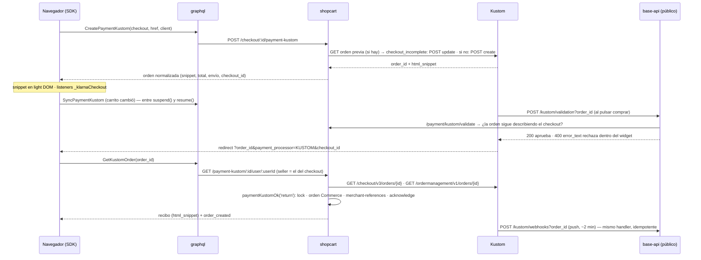

# Kustom Checkout en Vio Commerce

Kustom es Klarna Checkout v3 (KCO) con dueño nuevo: la misma API (`POST /checkout/v3/orders`
→ `html_snippet`), los mismos callbacks, la misma API JS del widget (`window._klarnaCheckout`)
y hosts propios (`api.kustom.co` / `api.playground.kustom.co`). Es un **checkout embebido**: el
widget pide dirección, envío y pago. Vio pone la orden (líneas, importes, tarifas de envío,
URLs) y recibe el pago por dos caminos que corren el mismo código.

Estado: código terminado y probado en unitario el 2026-09-18 (rama `feature/kustom-checkout`
en seis repos, ver [journal](../journal/2026-09/2026-09-18-kustom-terminar-integracion.md));
**sin probar contra el playground** porque el MID de test no tiene ningún país configurado.
Decisiones en [ADR-0020](../decisions/0020-kustom-una-orden-por-checkout.md).

## Lo que Kustom es y no es

| | Kustom |
|---|---|
| Qué pide el widget | Email, dirección de facturación, dirección de envío (`allow_separate_shipping_address`), tarifa de envío (de la lista que mandamos o del KSA del seller), método de pago |
| Importes | **Enteros en unidades menores**; `tax_rate` en puntos base (2500 = 25 %); `total_tax_amount` a ±1 de `total − total × 10000 / (10000 + tax_rate)`; `order_amount` = Σ líneas |
| Envío | Lo elige el comprador **dentro del widget** de la lista `shipping_options` (la primera va preseleccionada). Kustom **añade la línea `shipping_fee` al completar**: los totales que mandamos son de la mercancía |
| Sesión | La orden vive 48 h y **se actualiza en su sitio** (`POST /checkout/v3/orders/{id}`) entre `suspend()` y `resume()`. Nunca una orden nueva por un cambio de carrito |
| Callbacks (por orden, en `merchant_urls`) | `checkout`, `confirmation` (redirect del comprador), `push` (servidor, ~2 min después, reintentos 48 h hasta `acknowledge`), `validation` (al pulsar comprar, 3 s, fail-open) |
| Verdad post-compra | **Order Management** (`GET /ordermanagement/v1/orders/{id}`): `status` AUTHORIZED / PART_CAPTURED / CAPTURED / CANCELLED / EXPIRED / CLOSED y `fraud_status`. Un pedido que OM no conoce (404) no está pagado |
| Credenciales | Por seller, `kco_(test|live)_api_…`; el entorno sale del prefijo. **Sin fallback de plataforma** (decisión 2026-08-28): el dinero cae en la cuenta de Kustom del seller o el método no aparece |
| Markets | `purchase_country` + `purchase_currency` deben estar configurados en el MID del seller; Vio además aplica su limitación (catálogo ∩ markets del canal ∩ `KUSTOM_ENABLED_MARKETS = ['NO']`) |
| Métodos en Noruega | Los que Kustom tenga activos en el MID (tarjeta, factura/financiación Klarna, Vipps si está contratado); Vio no los elige |
| Captura | `options.auto_capture` (default `true` en Vio). Captura/refund por API quedan pendientes, como con los demás embebidos |

## El flujo



## Backend (shopcart)

- `providers/kustom-lines.ts` — puro: `kustomMinor`, `kustomTaxRate`, `kustomTaxAmount` (la fórmula
  de Kustom), `buildKustomLine`, `buildKustomDiscountLine` (IVA negativo), `buildKustomShippingOption`,
  `dominantTaxRate` (el IVA de la línea que más pesa, para la tarifa), `goodsAmount`, `kustomStatus`.
- `providers/kustom-market.ts` — la limitación por market; Noruega primero; locale `nb-NO`.
- `providers/kustomConnector.service.ts` — Checkout API (create / read / update) y Order Management
  (read, `acknowledge`, `merchant-references`) con `Klarna-Idempotency-Key` determinista
  (`kustomIdempotencyKey`). Auth `Basic <kco_key>` (verificado: Kustom acepta la key cruda,
  `base64(user:key)` y `base64(:key)`).
- `providers/kustom.service.ts` — `createOrUpdateOrder` (foto en `origin_payment_body` como
  `KustomCheckoutMeta`: importe de mercancía, líneas, tarifas, versión, ids de órdenes reemplazadas),
  `buildPayload` (`merchant_reference1` = checkout, `merchant_data` con `vio_*`, `validation` sólo con
  `API_HOST` https, colores del tema), `matchesMeta`, `normalize`, `settle`.
- `checkout.service.ts` — `paymentKustomOk(orderId, source)` bajo `withCheckoutLock`; `getPaymentKustom`
  / `getPaymentKustomByOrder` (completan al leer si Kustom dice `checkout_complete`);
  `validateKustomOrder`; el barrido `reconcileEmbeddedPayments` usa el mismo handler.
- `cart.service.ts` — `initPaymentKustom` (crea el checkout si falta, tarifas por
  `QliroService.resolveShippingChoices`, descuentos como líneas), `syncPaymentKustom`.
- Endpoints: `POST /checkout/:id/payment-kustom`, `POST /checkout/:id/payment-kustom/sync`,
  `GET /checkout/:id/payment-kustom`, `GET /checkout/payment-kustom/:id/user/:userId` (ruta antigua,
  seller ignorado), `POST /checkout/payment/kustom/push`, `POST /checkout/payment/kustom/validate`,
  y `/pre` + `/ok` para el relay antiguo.
- Config: `KUSTOM_TERMS_URL` (términos de plataforma cuando el seller no puso los suyos; WARN),
  `KUSTOM_API_URL` sólo como override.

**base-api**: `POST /kustom/webhooks?order_id=` → shopcart `/push`, **estado pasado tal cual**
(un fallo es 5xx y Kustom reintenta); `POST /kustom/validation?order_id=` → `/validate` → 200 o
400 `{error_type, error_text}`; sin respuesta = aprobado (fail-open, como Kustom a los 3 s).

**graphql**: `CreatePaymentKustom`, `GetKustomOrder` devuelven `KustomOrderDTO` (normalizado:
nunca la orden cruda con los datos del comprador); `SyncPaymentKustom(checkout_id)` nuevo.

**api**: `kustom-offer.ts` — interruptor del canal + clave del seller + market habilitado.

## SDK (`vio-web-sdk` 0.14.0)

- `payments/kustom.ts`: documentos GraphQL, `renderKustomSnippet` (re-crea los `<script>`; lo usan
  también Qliro y Walley), `kustomApi` / `suspendKustom` / `resumeKustom` / `installKustomListeners`
  (`load`, `order_total_change`, `shipping_option_change`, `can_not_complete_order`,
  `network_error`, `redirect_initiated`; `destroy()` los desarma porque Kustom no tiene `off`),
  `kustomReturnOutcome`.
- `vio-checkout`: contenedor en **light DOM** con slot `vio-kustom`; `kustomCartKey` →
  `syncKustomIfStale` (suspend → `SyncPaymentKustom` → resume; si falla, se desmonta y se vuelve a
  pedir); el total y la tarifa que reporta el widget alimentan el resumen; el retorno pagado va por
  `showProviderReceipt('kustom')` (el recibo sobrevive al vaciado del carrito); el rechazo de la
  validación (`?vio_payment=rejected&vio_method=kustom`) es un aviso.

## Lo que hay que hacer en el Kustom Portal (playground)

1. **Configurar el país**: el MID de test (`PM00876249`) responde `no configured currencies for
   order billing country` para cualquier `purchase_country`. Sin Noruega (NOK) activa no se puede
   crear ni una orden de prueba.
2. Métodos de pago del MID (tarjeta, Klarna, Vipps).
3. **`checkout` y `confirmation` tienen que ser https**: con `http://localhost:…` Kustom responde
   `Bad value: confirmation` antes incluso de mirar el market. Para probar el SDK en local hace
   falta un túnel https (el mismo caso que Adyen con sus allowed origins).
4. `push` y `validation` van **en cada orden**. Además existen los webhooks **de cuenta**, que sí
   sirven para avisar al comercio y hoy no aprovechamos: ver la sección siguiente.

## Webhooks de cuenta: probados el 2026-09-24

Probado en el playground con el portal delante y contrastado con
[su documentación](https://docs.kustom.co/contents/api/api-basics/webhooks). Esto es lo que
resuelve la pregunta de si un comercio puede enterarse de una venta que creamos nosotros.

**Cómo son.**

- Se configuran **solo en el portal**, en Developers → Webhooks, con *Start listening to webhooks*.
  No hay API documentada para crearlos, así que el destino lo añade el comercio.
- **Admiten varios destinos a la vez.** Se creó uno de prueba junto al que ya existía y **los dos
  recibieron los mismos eventos**.
- Eventos: `order.created`, `capture.created`, `refund.created`, `dispute.created`,
  `dispute.updated` y cinco de pagos presenciales.
- Firma estándar de webhooks: cabeceras `webhook-id`, `webhook-timestamp` y `webhook-signature`,
  con secreto propio por destino, rotable desde el portal. Reintentos hasta tres días.
- El portal muestra cada entrega, con estado, tiempo de respuesta y la carga completa, y permite
  reenviarla.

**Qué llega, y cuándo.**

- Crear el pedido de checkout **no dispara nada**: se comprobó creando uno por API y esperando un
  minuto sin recibir ningún evento. El aviso sale **al pagarse**.
- Al completar una compra de prueba llegaron dos eventos a la vez, `order.created` y
  `capture.created`, unos tres segundos después del pago:

```json
{
  "id": "kevt_HUy6wPdmeermNgDWhYSSC",
  "merchant_id": "PM00876249",
  "timestamp": "2026-09-24T09:32:15.654707826Z",
  "type": "order.created",
  "data": { "order_id": "360fb676-…", "created_at": "2026-09-24T09:32:12.487493Z" }
}
```

- Solo identificadores. Quien lo reciba tiene que leer el pedido completo con su propia clave, por
  `GET /ordermanagement/v1/orders/{id}`.

**Lo que esto significa.**

- **Un comercio con plataforma propia se entera de nuestras ventas sin que construyamos nada**: le
  basta con añadir su URL como destino en su portal. El pedido lo crea nuestra integración con su
  clave, y aun así el evento le llega a él.
- Sirve igual para lo contrario: **enterarnos de lo que hace el comercio**. Si captura o devuelve
  desde su portal, salen `capture.created` y `refund.created`.
- ⚠️ **Hasta el 2026-09-24 los tirábamos.** Ya existe un destino «Vio Webhook» apuntando a
  `https://api-ecom-staging.vio.live/kustom/webhooks`, creado el 22/09, con 46 entregas y todas en
  200. Pero ese relay lee el id del pedido de la **query string**, que es como lo manda el `push`
  por orden, y el webhook de cuenta lo manda **en el cuerpo**. Así que contestamos 200 y no hacemos
  nada. Arreglado en cuatro PR, pendientes de merge:
  [shopcart#37](https://github.com/vio-live/vio-shopcart-microservice/pull/37) verifica la firma
  y enruta el evento, [base-api#16](https://github.com/vio-live/vio-base-api/pull/16) distingue
  las dos notificaciones y reenvía los bytes firmados,
  [api#25](https://github.com/vio-live/vio-api-microservice/pull/25) cifra el secreto y
  [webapp#33](https://github.com/vio-live/webapp-vio-commerce/pull/33) lo pide en el alta del
  método, junto al identificador de comercio.

  Lo que hace ahora: `order.created` entra por el mismo camino idempotente que el push, y
  `capture.created` y `refund.created` se anotan en la foto del checkout. La firma es la
  autenticación; un pedido que no es nuestro se ignora en silencio, porque en esa cuenta la
  mayoría de los eventos son ventas de la propia tienda del comercio; y mientras ningún vendedor
  tenga secreto, los eventos se aceptan y se descartan, para no comprar tres días de reintentos.

## El dinero después del pago (en PR, 2026-09-24)

Hasta ahora el conector sabía crear, leer, confirmar y poner referencias, y lo único que decidía
el dinero era el cobro automático al pagar. En
[shopcart#38](https://github.com/vio-live/vio-shopcart-microservice/pull/38) y
[webapp#34](https://github.com/vio-live/webapp-vio-commerce/pull/34):

- **Capturar** (total o parcial, con el seguimiento pegado a su captura), **devolver** y
  **cancelar** contra Order Management.
- **Cada acción es opcional por vendedor**, porque dos partes capturando el mismo pedido le cobran
  dos veces al comprador:
  - `captureMode`: `account` (decide su cuenta y captura él, nosotros nunca), `payment` o
    `shipment`. **El valor por defecto es `account`**: captura él al despachar, como ya hace con
    sus ventas;
  - `manageRefunds` y `manageCancellations`, apagados por defecto.
  - Un vendedor que ya existe conserva su conducta: si no hay `captureMode`, se lee el booleano
    `autoCapture` de antes.
- Lo que pedimos nosotros se anota en la foto del checkout como `*.requested`; lo que Kustom hizo
  llega como evento de su cuenta y se anota al lado.

⚠️ **Capturar al despachar todavía no tiene quien lo dispare.** La señal de envío no llega hasta
el pago: ese camino está detrás de un canal que nuestras ventas nunca usan. Y Kustom no ayuda: su
asistente de envíos reserva el envío en el checkout, pero su API de envíos no dice si el pedido se
completó y no hay ningún evento de envío entre los suyos.

## Guía para el comercio: pasos en su portal de Kustom

Recorrido hecho el 2026-09-24 en el playground. Faltan las capturas de pantalla, que hay que
tomar desde el portal; el texto ya está verificado paso a paso.

1. **Clave de API.** Developers → API. Es la clave `kco_test_api_…` o `kco_live_api_…` que se
   carga en el dashboard de Vio, en Settings → Payments → Kustom. Sin fila propia del comercio no
   cobramos: Kustom nunca cae a la cuenta de Vio.
2. **País y moneda del MID.** El portal no deja añadirlos: lo hace el soporte de Kustom. En el MID
   de pruebas hubo que pedir Noruega, y hasta entonces cualquier intento de crear un pedido
   respondía `no configured currencies for order billing country`.
3. **Webhook para enterarse de las ventas.** Developers → Webhooks → *Start listening to webhooks*.
   - Paso 1: marcar los eventos. Para recibir las ventas basta con `order.created`; añadir
     `capture.created` y `refund.created` si su sistema también quiere el cobro y las devoluciones.
   - Paso 2: un nombre y la URL, que tiene que ser https.
   - Paso 3: confirmar con *Create destination*.
   - El secreto de firma sale en el detalle del destino, y desde ahí se rota.
   - Admite varios destinos: el del comercio convive con el nuestro y los dos reciben lo mismo.
4. **Comprobar que llega.** En el detalle del destino, la pestaña *Event deliveries* lista cada
   entrega con su estado, el tiempo de respuesta y la carga completa, y deja reenviarla.
5. **Ver la venta y gestionarla.** Menú Orders. Desde ahí el comercio captura, devuelve y cancela.
   ⚠️ Pendiente de recorrer con el portal delante: estas pantallas todavía no se han visto.

Lo que Vio necesita del comercio para conectarlo: la clave de API, su URL de términos, el modo de
captura y, si quiere el aviso directo de Kustom, la URL de su sistema.

## Primer contacto con el widget real (2026-09-22)

Hasta el 22/09 la tienda de pruebas `Test` (PM00876249) solo tenía Discover para Australia, y el
portal no deja añadir métodos ni países. El soporte de Kustom habilitó Noruega a pedido de Angelo.
Con `node ~/vio-commerce/tools/kustom-spike/spike.mjs` se comprobó en el playground:

- **Pedido para NO/NOK:** `POST /checkout/v3/orders` → 201. Se actualiza en el mismo pedido → 200.
  Gestión de pedidos responde 404 antes de pagar.
- **Montaje:** el widget se ve montado en un contenedor de light DOM proyectado por un slot, como
  en el SDK.
- **API JS:** `_klarnaCheckout` existe. `load` trae el país y el envío elegido.
  `order_total_change` trae el total en unidades menores, con el envío incluido.
- **Suspender y reanudar:** `suspend()` deja el widget en gris y `resume()` lo reactiva.
- **Volver a montar el mismo pedido sin recargar:** funciona, y `load` vuelve a llegar. En cambio
  `order_total_change` **no** vuelve a llegar, así que el total tiene que salir del pedido que
  devuelve el backend. El SDK ya lo hace así.
- **iframe auxiliar:** Kustom añade uno oculto en `document.body` para sus capas a pantalla
  completa. No se duplica al volver a montar.
- **Trampa al incrustar el snippet dentro de un `<script>` propio:** trae sus propias etiquetas
  `<script>`, así que hay que escapar los `<`, o su `</script>` cierra el nuestro. El SDK no se ve
  afectado, porque lo mete por `innerHTML`.

## Datos de prueba del playground

- **Métodos activos para Noruega** en la tienda `Test` (PM00876249), desde el 22/09: Visa,
  Mastercard, Klarna, Apple Pay y Google Pay. Discover sigue solo para Australia. Los mercados y
  métodos los habilita el soporte de Kustom; el portal no permite hacerlo.
- **Datos de prueba oficiales:** el botón **"Test Data"** del widget, en Test Mode. Tiene tarjetas,
  con cualquier fecha futura y CVC: Visa `4242 4242 4242 4242`, Mastercard `5555 5555 5555 4444`,
  3DS `4000 0027 6000 3184` y rechazada `4000 0000 0000 0002`. También credenciales de PayPal y
  Resurs, que no están activos, y la nota de Google Pay: hay que unirse al grupo de test de Google,
  o su modo test solo admite direcciones de EE. UU.
- **Cliente de prueba noruego** (doc de Kustom): `Edvard Munchs Plass 1, 0194 Oslo`,
  `40 12 34 56`, nacimiento `03/09/1971`, fødselsnummer `110779-41012`.
- **Klarna dentro del widget:** lo cobra Kustom, así que no depende de la cuenta de Klarna de la
  plataforma.
- **Apple Pay:** Kustom no da datos de prueba.
- **Guía para QA:** tarjeta de Alan [ZgnheyI8](https://trello.com/c/ZgnheyI8).

## Pendiente
- E2E en el playground: tarjeta `4242…`, 3DS `4000002760003184`, cambio de tarifa dentro del
  widget, cambio de carrito con el widget abierto (sync), cierre y reapertura (¿re-inicializar el
  snippet sin recargar rompe algo? Kustom lo desaconseja), validación rechazada, push sin
  `acknowledge`, orden con captura automática en el portal.
- Captura/refund/cancel por API (payment-processors sólo conoce Klarna); estado de la orden Commerce
  cuando Kustom captura o cancela.
- `order.paid` al ecommerce del seller: el genérico; Kustom no tiene URL de aviso propia.
- Kustom Elements (express buttons) exige KSA; fuera de alcance.
- **Native Partner Onboarding API** de Kustom (crear merchants, credenciales y widget de KYC desde
  Vio): el "conecta tu Kustom" sin copiar claves; requiere acuerdo de partner.
