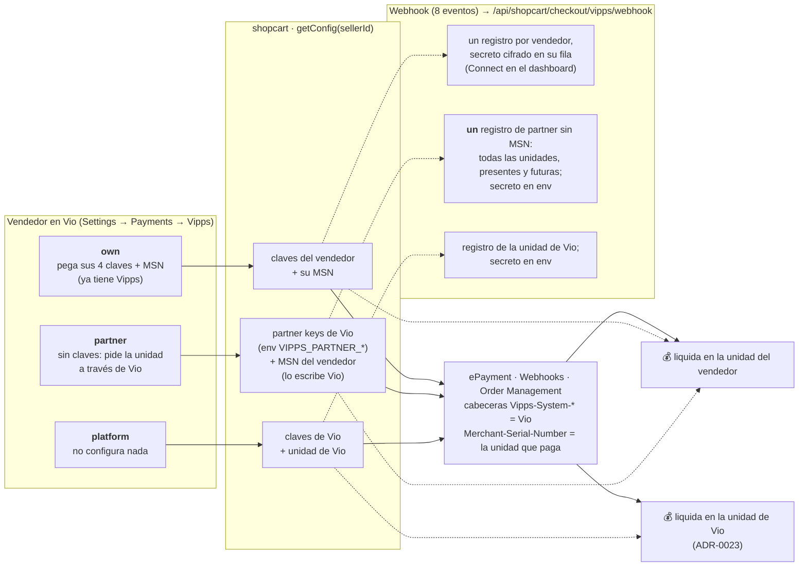
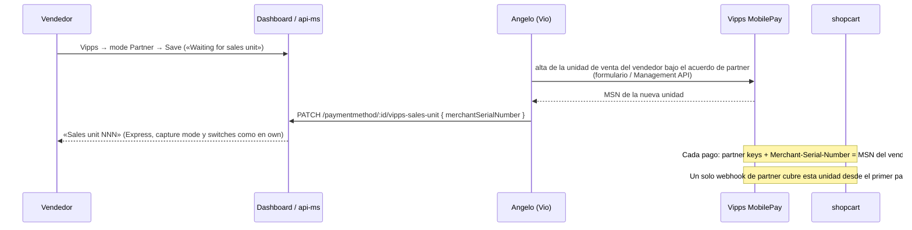

# Vipps MobilePay en Vio Commerce

> Estado al 2026-09-29. Código en `vio-shopcart-microservice` (`providers/vipps*.ts`,
> `paymentVippsOk` en `checkout.service.ts`), relay en `vio-base-api`, sonda en
> `vio-api-microservice`, campos en `webapp-vio-commerce`, botones en `vio-web-sdk`.
> Todo en PR el 2026-09-29 (links al final); nada en producción todavía.

## Lo que Vipps nos ofreció (2026-09-29)

Un **partnership**. El anunciante que no tiene cuenta de Vipps firma **una unidad de venta
(salgsenhet, MSN) a través de Vio**: Vipps le manda un formulario prellenado, él lo firma,
sin ningún setup técnico. El dinero de cada pago **liquida en su banco**; nosotros nunca lo
tocamos. Vio cobra en su nombre con **partner keys**: una sola credencial nuestra que sirve
para todas las unidades bajo el partnership, identificando al comercio con la cabecera
`Merchant-Serial-Number` en cada llamada. Aprueban nuestra integración **una vez** (ePayment
Checklist) y vale para todos los comercios. Recomiendan **Express** para el in-article: en móvil
la app se abre con dirección y envío ya puestos.

Lo que la documentación añade y condiciona el diseño:

- **Las partner keys no pueden ser visibles para el comercio, y él no puede ver ni editar su
  MSN** dentro de nuestra solución ([partner keys](https://developer.vippsmobilepay.com/docs/partner/partner-keys/)).
  Un comercio que pudiera cambiar su MSN pagaría como otro. Por eso en el dashboard el modo
  «partnership» no tiene campos: el MSN lo pone Vio.
- **Las partner keys y la Management API existen solo en producción.** En test, Vipps da a los
  partners claves de una unidad de prueba
  ([test environment](https://developer.vippsmobilepay.com/docs/knowledge-base/test-environment/)).
  En QA, `VIPPS_PARTNER_*` caen a `VIPPS_*` y lo que cambia es la cabecera.
- **El alta** ([merchant signup](https://developer.vippsmobilepay.com/docs/partner/merchant-signup/)):
  Merchant Agreement → Product Order (prellenable por Management API, `POST
  /management/v1/product-orders`, o plantilla del portal). Tarda «unos días». Al aprobarse,
  Vipps avisa por email a comercio y partner con la unidad, y ya se puede cobrar.
- **Express** ([how it works](https://developer.vippsmobilepay.com/docs/APIs/epayment-api/how-it-works/express/)):
  `WALLET` + `profile.scope` con `address` + `shipping` (fijo o dinámico) + `WEB_REDIRECT`.
  El pago vuelve con `userDetails` y `shippingDetails.shippingOptionId`. En móvil la app se
  abre sola; en desktop Vipps ofrece «enviar al teléfono».
- **Reserva**: 180 días en Noruega, pero la tarjeta detrás puede liberar a los 5-7. Por
  regulación no se captura hasta que la mercancía esté lista para entregar; la captura
  inmediata solo si se entrega al instante
  ([reserve and capture](https://developer.vippsmobilepay.com/docs/knowledge-base/reserve-and-capture/)).
- **Webhooks** ([Webhooks API](https://developer.vippsmobilepay.com/docs/APIs/webhooks-api/api-guide/)):
  alta por unidad, o **sin MSN con partner keys: cubre todas las unidades bajo el partner,
  incluidas las futuras**. Firma HMAC-SHA256 estilo Azure (`x-ms-date`, `x-ms-content-sha256`,
  `Authorization`) con el `secret` que devuelve el alta — única copia. Reintentos siete días.
- **Checklist** ([ePayment checklist](https://developer.vippsmobilepay.com/docs/APIs/epayment-api/checklist/)):
  create/get/events/cancel/capture/refund; webhooks **y** polling; manejar todos los estados;
  cabeceras `Vipps-System-*` (obligatorias para partners); cancelar lo que no se captura;
  PDF + vídeo del flujo para la aprobación.

## Decisión: Express es un modo de Vipps, no un método aparte (2026-09-30)

Angelo pidió pensarlo bien y que siguiera el estándar de los demás métodos. Lo que hacen los
demás:

| Cosa | Cómo lo hacen los otros | Vipps |
|---|---|---|
| Un instrumento distinto | Método propio con interruptor de canal (`applePay`, `googlePay`) | No aplica: Express es el mismo pago de Vipps |
| Una variante del mismo PSP | `config` del método en `GetAvailablePaymentMethods` (Stripe: `mode: native\|link`) | **Igual**: `config.express: true\|false`, leído de la fila del vendedor |
| Crear el pago | `CreatePayment<PSP>` en GraphQL | `CreatePaymentVipps(express?)` |
| La vuelta | `SyncPaymentKustom`, `SyncPaymentQliro`… completan la orden | `GetVippsStatus` completa la orden y dice `state`, `reference`, `order_created`, `order_id` |
| Aviso de la PSP | relay en base-api con la firma → shopcart | igual |
| `checkout.payment_method` | el nombre en mayúscula (`Kustom`, `Adyen`…) | `Vipps` (era `vipps`; las lecturas siguen sin distinguir mayúsculas) |
| Dinero | `captureMode` + switches por vendedor (Kustom) | igual, más los avisos por id de orden desde orders-ms |

Por qué un modo y no un método: misma credencial, mismo webhook, misma ruta de completar; en la
propia API de Vipps Express es un flag (`shipping`) del mismo pago. Un método aparte habría
duplicado interruptor, sonda, fila y avisos para nada. El SDK lo lee con
`Vio.checkout.getVippsExpressEnabled()` y decide si los botones "Kjøp nå med Vipps" abren la
app o el checkout. PRs: [api-ms#32](https://github.com/vio-live/vio-api-microservice/pull/32) (`config.express`),
[web-sdk#70](https://github.com/vio-live/vio-web-sdk/pull/70) (lectura + Express desde el checkout),
[shopcart#47](https://github.com/vio-live/vio-shopcart-microservice/pull/47) (`Vipps`),
[graphql#18](https://github.com/vio-live/graphql/pull/18) (`GetVippsStatus` completo).

## Cómo queda

### Credenciales: tres modos por vendedor

| Modo | Fila `payment_method` (`name: 'VIPPS'`) | Claves | Quién pone el MSN |
|---|---|---|---|
| `own` | `clientId`, `clientSecret`, `subscriptionKey`, `merchantSerialNumber` | del vendedor | el vendedor |
| `partner` | `mode: 'partner'`, `merchantSerialNumber` | `VIPPS_PARTNER_*` (en test → `VIPPS_*`) | **Vio**, cuando Vipps confirma |
| `platform` | sin fila | `VIPPS_*`, unidad de Vio | — (ADR-0023) |

Más las opciones comunes: `captureMode` (`account` por defecto / `payment` / `shipment`),
`manageRefunds`, `manageCancellations`, `referenceFormat` (`VIO-{checkout}`; `{short}` = ocho
caracteres), `express` (activo por defecto), `shippingMode` (`fixed` por defecto / `dynamic`:
Vipps pregunta las tarifas por dirección), `webhookSecret`/`webhookSecretPrevious`
(cifrados; los guarda el alta del webhook, nadie los pega).

### Los tres modos, en un dibujo (2026-10-06)

Lo que cambia entre modos es **de quién son las claves y quién da de alta la unidad de venta**;
el pago, la orden, el webhook y el dinero recorren el mismo código.

Alta de un vendedor por el partnership (producción; en test «partner functionality is not
available», así que una fila `partner` usa las claves de plataforma como sustituto):

Qué **no** cambia con el partnership: el flujo de pago (Express o plano), la orden en Vio y
su enrutamiento a la tienda, la captura/devolución/cancelación desde la orden, el recibo, y
que Vio nunca toca el dinero. Qué **sí**: nadie pega claves, el MSN lo escribe Vio, un solo
webhook y un solo secreto para todas las unidades firmadas por Vio, y las cabeceras
`Vipps-System-*` pasan de recomendadas a obligatorias (ya van en todas las llamadas).

### El flujo

1. **Botón Vipps** (producto o carrito, SDK) → `CreatePaymentVipps(express: true)` → shopcart
   `POST /:id/:channelUserId/payment-vipps`. Un supplier y una tarifa para el país → pago
   **Express** con todas las tarifas del supplier como `fixedOptions` (agrupadas por
   transportista y tipo, en la moneda del pago, `allowedCountries` = el país). Si no se puede
   (varios suppliers, digital, sin tarifa) **no se crea pago** y se contesta `express: false`
   con el motivo: el SDK abre el checkout normal con Vipps preseleccionado.
2. Dentro del checkout, Vipps es **un clic** y también **Express** (2026-09-30): el checkout
   preselecciona nuestra tarifa más barata al abrirse, así que un pago plano desde ahí se la
   quedaba en silencio y el comprador no podía cambiarla (el formulario de entrega se esconde
   con Vipps). Ahora el SDK pide `express: true` cuando el canal lo permite — la tarifa del
   carrito viaja como preseleccionada en la app — y cae al pago plano solo si el backend dice
   que el carrito no puede (varios suppliers) o si el vendedor apagó Express. No se pide email.
3. Referencia `VIO-{checkout}` (reintento = `-n`), `paymentDescription` = el nombre del
   vendedor, `metadata` con checkout/canal/vendedor/flujo, cabeceras `Vipps-System-*` = Vio.
4. **Completar — una sola ruta**, `paymentVippsOk(reference, source)`, para el retorno del
   comprador (`/payment-vipps/status`), el webhook, y el barrido de reconciliación. Bajo el
   lock del checkout; decide el `GET payment` de Vipps, nunca el body del webhook:
   `AUTHORIZED` → envío al carrito **por id**, persona al checkout (Express trae ambos; el
   flujo plano lee Userinfo), `completeBaseOrder` → orden en orders-ms (`paymentProcessor:
   'Vipps'`, `channelId` = referencia, teléfono incluido) → `processOrderPaidByCustomer`
   (email, Shopify, `order.paid`). El checkout se marca pagado **antes** de procesar, así un
   reintento nunca crea una segunda orden; si orders-ms no procesa, queda `processed: false`
   y se reintenta en la siguiente llamada. `ABORTED/EXPIRED/TERMINATED` → checkout `CANCEL`.
5. **Después de la orden**: captura si `captureMode = 'payment'`; **recibo** a Order
   Management (`POST /order-management/v2/ecom/receipts/{reference}`) con líneas (SKU,
   IVA), la línea de envío y **nuestro número de orden** — a mejor esfuerzo: un recibo
   rechazado no cuesta la venta.
6. **Webhook** (`/api/shopcart/checkout/vipps/webhook` → base-api reenvía bytes crudos +
   cabeceras + host y path públicos → shopcart `/payment/webhook/vipps`): los 8 eventos;
   firma verificada contra los secretos de la unidad (fila del vendedor, partner, platform);
   dedupe por `idempotencyKey`; `AUTHORIZED/ABORTED/EXPIRED/TERMINATED/CANCELLED` → la ruta
   única; `CAPTURED/REFUNDED` → se anotan en la foto del checkout. Sin secreto configurado el
   aviso es solo una pista (el estado de Vipps decide igual).
7. **Dinero desde el dashboard o el sistema del vendedor**: `POST
   /payment/vipps/:checkoutId/{capture,refund,cancel}`, tras los switches del vendedor.

### Órdenes

La orden de Vipps entra en `processOrderPaidByCustomer`, que crea la orden en Shopify
(extensions, `financial_status: paid`, `source_name: channel:<handle>`, y desde el 2026-09-29
`note_attributes: [{ vio_order_id }]`) para productos de origen Shopify, y dispara `order.paid`
al webhook del vendedor para el feed. Pendiente decidir si la orden de Shopify debe salir
`authorized` hasta la captura.

**El dinero sigue a la orden** (2026-09-29): la orden lleva `paymentProcessor: 'VIPPS'` y
orders-ms avisa a shopcart en dos momentos, por nuestro id de orden:

| Momento | Quién lo dispara | Qué hace shopcart |
|---|---|---|
| **Despachada** — `saveTrackingNumber` | El dashboard (tracking), o extensions cuando llega el `orders/fulfilled` de Shopify por Pub/Sub | `POST /payment/vipps/order/:id/shipped`: captura lo reservado **solo si** `captureMode = 'shipment'`; con `account` o `payment` no hace nada y lo dice. |
| **Cancelada** — `cancelOrder` | El dashboard | `POST /payment/vipps/order/:id/cancelled`: libera la reserva, o devuelve lo capturado; tras los switches del vendedor — un 400 «own portal» se registra y la cancelación de la orden sigue. |

Ninguno de los dos es fatal para la orden: el cambio de estado es el registro, y el vendedor
que mueve el dinero desde su portal recibe exactamente eso como respuesta. La aprobación de
una devolución no mueve dinero para ningún PSP hoy (tampoco antes).

### El importe en Express, y de dónde salen los envíos

**Vipps suma al `amount` la tarifa que el comprador elige en la app.** Por eso en Express viaja
solo la mercancía (total del checkout − envío del carrito) y la tarifa del carrito va como
opción preseleccionada; en un pago plano viaja el total tal cual. El primer pago desde el
checkout en QA (2026-09-30) mandó mercancía + tarifa preseleccionada — el envío se habría
cobrado dos veces — y lo arregló [shopcart#48](https://github.com/vio-live/vio-shopcart-microservice/pull/48).

**Vipps no tiene servicio de envíos propio en ePayment.** Las opciones son siempre del
comercio, de dos formas ([doc](https://developer.vippsmobilepay.com/docs/APIs/epayment-api/api-guide/features/express/)):

| Forma | Qué es | Nosotros |
|---|---|---|
| `fixedOptions` | Las tarifas van en la creación del pago, agrupadas por transportista (`brand`: POSTEN, BRING, POSTNORD, HELTHJEM…) y tipo (`HOME_DELIVERY`, `PICKUP_POINT`, `MAILBOX`, `IN_STORE`) | **Hecho**: nuestras tarifas del supplier, con transportista y tipo inferidos del nombre |
| `dynamicOptions` | Vipps hace `POST` a un `callbackUrl` nuestro con la dirección del comprador y contestamos las opciones | **Hecho el 2026-09-30** (`shippingMode: 'dynamic'` en la fila del vendedor): contestamos nuestras tarifas del **país de la dirección**, agrupadas igual; 400 si no enviamos allí; token por pago en `Authorization`. `allowedCountries` = todos los países con tarifa. Es donde se enchufa un TMS (nShift, Ingrid, Bring…) después |

El producto que sí traía envíos integrados (Posten, Bring, Porterbuddy, Helthjem, Instabox) era
**Vipps Checkout**, y Vipps lo vendió a Kustom (su doc queda «para integraciones existentes»).

### Usuarios de prueba (app MT)

No hay ninguno registrado en nuestros repos: se crean en el portal, con la cuenta que tiene la
unidad de prueba «Tipio» (358493). `portal.vippsmobilepay.com` → **For developers** → pestaña
**Test users** → *Add a new test user*: el portal asigna teléfono y un NIN ficticio, con una
tarjeta precargada. En la app MT (iOS: TestFlight `testflight.apple.com/join/hTAYrwea`): país
Noruega → NIN → teléfono → código `0000`/`000000` → código personal `1236` (dos veces). Nunca
usar esos teléfonos en producción.

## Lo que hay que hacer fuera del código

| Quién | Qué |
|---|---|
| Angelo | **Solicitar el programa de partners** (Vipps lo pidió; sin eso no hay entorno de test). |
| **Miguel** (decidido 2026-10-06) | Poner en el `.env.local` de QA la unidad de prueba que Vipps dio a Vio como partner (**NewCo AS, MSN 545865**; valores en el correo de Vipps a Angelo del 06/10): `VIPPS_CLIENT_ID`, `VIPPS_CLIENT_SECRET`, `VIPPS_SUBSCRIPTION_KEY`, `VIPPS_MERCHANT_SERIAL_NUMBER=545865`. Las que hay contestan **401**. Después **re-run del deploy** de shopcart (y de api-ms, que también lee `VIPPS_CLIENT_ID/SECRET/SUBSCRIPTION_KEY`; base-api solo para el camino legacy). **Segundo paso**, desde dentro del clúster: `kubectl --context kubernetesqa-sc port-forward svc/shopcart 18080:80` y `curl -X POST http://127.0.0.1:18080/checkout/register/webhook/vipps -H 'content-type: application/json' -d '{"scope":"platform"}'` → la respuesta trae `secret` **una sola vez** → `VIPPS_WEBHOOK_SECRET` en el mismo `.env.local` → otro re-run de shopcart. (Al 06/10 la unidad 545865 no tiene ningún webhook registrado; hasta el segundo deploy sus avisos se rechazan por firma, pero los pagos completan igual por la vuelta del comprador y el barrido.) Procedimiento: [playbook](../playbooks/commerce-deploy.md#cambiar-variables-del-entorno-de-qa-envlocal-en-el-storage). |
| Angelo | Tras ese deploy: Bohus → Settings → Payments → Vipps → Edit → modo **Partner** → Save («Waiting for sales unit»). |
| Claude | Tras lo anterior: `PATCH api-ms /paymentmethod/:id/vipps-sales-unit { data: { merchantSerialNumber: "545865" } }` sobre la fila de Bohus; pago de prueba por el camino partner (force approve con el usuario de prueba), webhook con firma válida, orden y recibo; rehacer las referencias del checklist sobre 545865. |
| Angelo | Un usuario de prueba + la app MT (TestFlight) en su teléfono para el E2E. |
| Vio (clúster) | Registrar el webhook: `POST shopcart /checkout/register/webhook/vipps` con `scope: 'platform'` en QA (devuelve el secreto → `VIPPS_WEBHOOK_SECRET`); en prod además `scope: 'partner'` (→ `VIPPS_PARTNER_WEBHOOK_SECRET`). Un vendedor con claves propias lo conecta desde el dashboard. |
| Vio (clúster) | **Asignar la unidad de venta** cuando Vipps confirma una firmada por el partnership: `PATCH api-ms /paymentmethod/:id/vipps-sales-unit { data: { merchantSerialNumber } }` — interno, sin proxy en base-api; solo acepta una fila de Vipps en modo partnership. El dashboard del vendedor pasa de «Waiting…» a «Sales unit NNN». |
| Angelo | Prod: partner keys en el entorno, checklist de ePayment (PDF + vídeo), alta de comercios con Management API. |

## Página de prueba con el web SDK

**https://vio-vipps-test.vercel.app** (Vercel, proyecto `vio-vipps-test`). HTML estático + bundle
del SDK 0.17.0 (`esbuild core+ui`, sin React) que hace de Vio backend para sí misma: intercepta
`GET /v2/mobile/config` y responde un sponsor (Bohus, canal 498) con la API key del canal, que se
pega una vez y queda en `localStorage`. Productos por defecto: el catálogo de Bohus en QA, en tarjetas propias con los **dos caminos por
producto**: «Legg i handlekurv» (carrito → checkout → Vipps) y «Kjøp nå med Vipps» (Express).
Sirve para probar en un móvil real sin Vev. Regenerar el bundle: `esbuild src/_page-entry.ts`
con `export * from './core/index.js'` + `export * from './ui/index.js'` (el `src/index.ts` del
SDK no registra los elementos). Fuente en el scratchpad de la sesión del 2026-09-29; vale la pena
moverla a un repo si se sigue usando.

## En Vev (2026-09-30)

Con el paquete compartido publicado y la página republicada, el detalle, el carrito y la kasse
muestran sus botones de Vipps solos (vienen del SDK). La **card** de Vev (suelta, carrusel, grid)
tiene además la opción «Vipps Express button» ([vev#49](https://github.com/vio-live/vev/pull/49)),
**off por defecto** para no cambiar páginas publicadas: añade una unidad y abre la app; con
variantes abre el detalle; si el canal no ofrece Vipps no se pinta; con Express apagado abre la
kasse con Vipps. La oferta se lee una vez por sponsor para todas las cards de la página.

## Después de la orden: qué avisa a Vipps (2026-09-30)

| Pasa en… | orders-ms avisa | shopcart hace |
|---|---|---|
| Tracking guardado (Shopify fulfillment, Woo con plugin de tracking, Aftership) | `shipped` | captura si `captureMode = shipment` |
| Orden completa (todos los ítems; p. ej. `completed` de Woo sin tracking, o a mano) | `shipped` | ídem; el segundo aviso → `skipped` |
| Cancelar la orden (dashboard) | `cancelled` | libera la reserva o devuelve lo capturado (switches) |
| Último ítem cancelado (p. ej. `cancelled` de Woo, ítem a ítem) | `cancelled` | ídem; el segundo aviso → `ignored` |
| Un ítem de varios cancelado | nada | **limitación**: al enviar se captura todo |
| Capture/refund/cancel desde el portal de Vipps | (webhook) | registra el evento; la orden no cambia — **limitación** |

## Estado en QA (2026-09-30)

Todo lo de arriba está desplegado en QA (shopcart redesplegado a mano tras el choque de tres deploys,
ver [lesson](../lessons/merges-seguidos-del-mismo-servicio-chocan-en-helm.md)). Verificado desde la
página de prueba: Express desde el producto y Vipps desde la kasse llegan a `pay-mt.vipps.no` con el
importe **sin** envío («Pay 4,999 NOK to Tipio» para 4 999 + 199 de frakt), y el callback de tarifas
responde por el relay público (`POST /api/shopcart/checkout/vipps/shipping` → 404 «not ours» para una
referencia ajena). Sin aprobar aún: hace falta un usuario de prueba con la app MT. El webhook del
vendedor 1322 sigue sin conectar (botón «Connect» del dashboard).

## Estado en QA (2026-10-06): pagos aprobados de verdad, y lo que salió al apretar

Con el usuario de prueba que dio Vipps (`4795111218`) y el *force approve* de test se aprobaron por
API cuatro pagos hechos por nuestra integración (GraphQL `CreatePaymentVipps` → shopcart, unidad de
prueba MSN 358493, Bohus 1322 / canal 498): R1 `VIO-d18d614e-…` → orden **4430** (capturas parciales
1000 + 3999, devolución parcial 500), R2 `VIO-0dc9ced1-…` → orden **4431** (reserva liberada), R3
`VIO-27cb60cf-…` → orden **4432** (captura total, devolución total), R4 `VIO-f0bb69da-…` (Express,
solo creado: Express no se puede aprobar por API en test). Las órdenes las creó nuestro webhook. Son
las referencias del checklist ([respuestas](../partners/vipps/checklist-answers.md)).

Lo que se rompió al usar los endpoints de verdad, y cómo quedó:

| Encontrado | Arreglo |
|---|---|
| El recibo a Order Management devolvía 400 «Both tax rate and tax percentage set»: mandábamos `taxRate` y `taxPercentage`. | Solo `taxPercentage` ([shopcart#59](https://github.com/vio-live/vio-shopcart-microservice/pull/59)). |
| El recibo decía «Item» y 3999.20 en un pago de 4999.00: `sendReceipt` leía `title` / `price.amount_incl_taxes` / `tax_rate`, pero el checkout formateado trae `product_title` / `price.amountInclTaxes` / `taxRate`; caía a `price.amount`, que es sin IVA. | Lee las dos grafías, bruto primero ([#62](https://github.com/vio-live/vio-shopcart-microservice/pull/62)); `POST /checkout/payment/vipps/order/:id/receipt` reenvía el recibo de una orden (#59). |
| Con `captureMode = account` tampoco se podía capturar **a mano** desde Vio: `VippsService.capture` rechazaba toda captura en ese modo, incluida la del botón de la orden. | «On account» = el vendedor captura a mano, en su portal **o en Vio**: la ruta del dashboard pasa `manual: true`; las automáticas (al pagar, al despachar) siguen rechazadas (#59). |
| Devolver sin importe respondía «449900 left to refund»: `vippsRefund` exigía importe (capture no). | Sin importe devuelve lo que queda ([#61](https://github.com/vio-live/vio-shopcart-microservice/pull/61)); el controller convertía body vacío en `0` ([#63](https://github.com/vio-live/vio-shopcart-microservice/pull/63)). |
| Express con envíos *dynamic*: «The business can't ship to this address» en la app. El callback de Vipps llega en **camelCase** (`reference, addressLine1, addressLine2, city, postCode, country`), no con mayúscula inicial como documenta Vipps; leíamos solo la forma documentada → país «?» → 400. | El callback se lee sin distinguir mayúsculas, con alias y dirección anidada, y el log dice qué claves llegaron ([#65](https://github.com/vio-live/vio-shopcart-microservice/pull/65)). Verificado: NO 2016 → 2 opciones en 42 ms. Con envíos *fixed* Vipps no llama, por eso nadie lo había visto. |
| La unidad de prueba tenía **cuatro** webhooks registrados con la misma URL: cada guardado de las claves registraba otro y Vio solo guarda el último secreto → cada evento llegaba cuatro veces, tres rechazadas («signature mismatch») y Vipps las reintentaba. | El alta lista lo que Vipps tiene en nuestra URL, conserva el registro cuyo secreto está en la fila, borra el resto y solo registra si no hay nada que conservar (#62). |

Dos pods del CronJob `shopcart-reconcile` fallaron a las 06:05 y 06:08 UTC («Failed to connect to
shopcart:80»): el clúster de QA despierta a las 06:00 y shopcart aún no estaba listo; a los 10 minutos
corrió bien. No hay nada que arreglar.

## Pendiente

- E2E en QA: producto → app de Vipps → orden en Vio → orden en la dev store de Shopify →
  `order.paid`; capture/refund/cancel; firma en logs; el barrido recupera un webhook perdido.
- ~~Captura al despachar desde el fulfillment de Shopify~~: cableada el 2026-09-29 (arriba).
  Queda por ver en QA que el `orders/fulfilled` de la dev store llega a
  `handleSaveTrackingNumber` con los ítems de la venta.
- ~~Estado de pago en la orden (capturado / devuelto)~~: la card «Vipps payment» de la orden del dashboard
  (2026-10-06) muestra reservado/capturado/devuelto/liberado, el log de eventos de Vipps y capture/refund/cancel.
  Queda: que lo que el vendedor hace en su portal mueva la orden en Vio y en Shopify.
- ~~Assets oficiales del botón de Vipps en el SDK~~: web component oficial en SDK y card de Vev (2026-10-06).
- ~~Rebundle de Vev con el SDK nuevo (0.17.0)~~: mergeado ([vev#48](https://github.com/vio-live/vev/pull/48)) y **paquete compartido publicado el 2026-09-30** (`vev deploy`, Angelo). Falta republicar las páginas (Bohus, la de Alan).
- Alta de comercios desde el dashboard/admin con Management API (prod).
- El camino legacy de base-api (`/vipps/*`, eCom v2 con claves de Vio) no lo llama nadie
  desde nuestros repos; retirarlo cuando se confirme que ningún cliente externo lo usa.

## PRs (2026-09-29)

[shopcart#45](https://github.com/vio-live/vio-shopcart-microservice/pull/45) ·
[base-api#21](https://github.com/vio-live/vio-base-api/pull/21) ·
[api-ms#30](https://github.com/vio-live/vio-api-microservice/pull/30) ·
[graphql#16](https://github.com/vio-live/graphql/pull/16) ·
[web-sdk#69](https://github.com/vio-live/vio-web-sdk/pull/69) · [webapp#40](https://github.com/vio-live/webapp-vio-commerce/pull/40) ·
[extensions#12](https://github.com/vio-live/vio-extensions-microservice/pull/12) (note_attributes) ·
[orders-ms#12](https://github.com/vio-live/vio-orders-microservice/pull/12) (el dinero sigue a la orden) · [vev#48](https://github.com/vio-live/vev/pull/48) (rebundle 0.17.0). **Todos mergeados el 2026-09-29 y desplegados en QA**, salvo vev#48 (publicar el paquete compartido es de producción).
