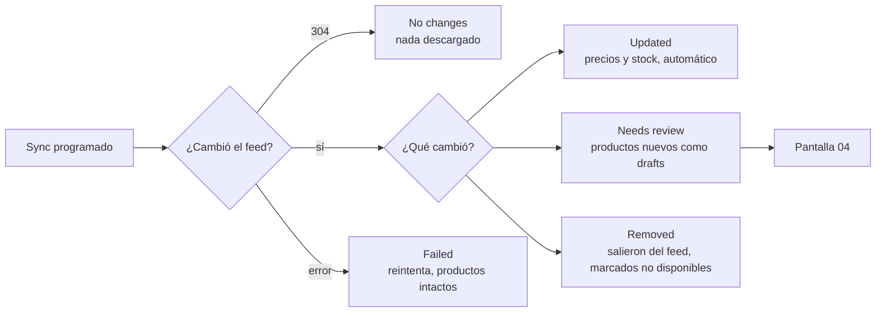

# Feed de producto — diseño del flujo en el dashboard

> 2026-08-26 · dirigido por angelo, ejecutado por claude.
> Acompaña a [`google-merchant-feed.md`](./google-merchant-feed.md), que tiene el
> plan técnico y el estado de las ramas. Este documento es **solo el flujo de UI**.

Convierte el import de un tiro que existe hoy en una **conexión gestionada**, al
lado de Shopify y Woo. Se registra una vez y se mantiene sola.

## De dónde partimos

Ya hay UI para esto y funciona: `Settings → Import tools → Google Shopping feed`,
un input de URL y un botón, pegando a `POST /admin/google-merchant-feed` desde
`src/lib/settings.js:74` (`importGoogleFeed`). El componente es `ImportSection` en
`src/views/settings/sections/rest.jsx`.

Le das a importar y esperás con un spinner. No hay preview, ni progreso, ni
re-sync, ni forma de ver qué pasó después.

## Decisiones tomadas

| | |
|---|---|
| **Cuenta** | Se la creamos nosotros al merchant. No hace falta UI de operador ni selector de cuenta. |
| **Modelo** | Conexión gestionada, no import puntual. |
| **Drafts** | La primera importación deja todo en draft. Los syncs siguientes aplican solos. |
| **Alcance** | Se importa el catálogo completo; la curación se hace en Collections. |
| **Ubicación** | `Settings → Integrations` (grupo Selling), con Shopify y Woo. Sale de Import tools. |
| **Aprobación** | Pantalla de revisión propia, agrupada por categoría. |
| **Cadencia** | La elige el usuario, entre opciones acotadas. |
| **Historial** | Solo la última corrida. |

## Las pantallas

### 01 · Conectar

Tarjeta "Product feed" en Integrations, junto a Shopify y WooCommerce. Estado
inicial `Not connected`, un campo **Feed URL** y un botón **Check feed**.

Validar en el front antes de mandar: que responda, que sea XML, que traiga
`<item>`, y que apunte a un host público. Los mensajes ya existen en base-api:

- `Feed url is not a valid URL`
- `Feed url must use http or https`
- `Feed url must point at a public host`
- `File need to be XML`
- `Feed contains no <item> entries`

El tercero no es cosmético: la URL la descarga una Cloud Function del lado del
servidor, así que se rechazan localhost, IPs privadas y el metadata endpoint de
GCP. Ya está implementado.

El endpoint también acepta un XML subido. Un archivo suelto no se puede
re-sincronizar, así que eso queda como import de un tiro, no como conexión.

### 02 · Confirmar lo que encontramos

Antes de escribir nada, mostrar qué trae el feed. Parsear no escribe: los
productos se publican al bus recién al confirmar.

Resumen (cifras reales del feed de Kondomeriet): **2 402 productos**, 173 con
variantes, 76 categorías, 939 sin stock, moneda NOK.

Debajo, la cadencia — **Every hour** (default), *4 times a day*, *Once a day*.
Que sea un campo evita tocar código cuando el merchant nos pida respetar un
límite de polling. Cada hora cuesta casi nada: mandamos `If-None-Match` y
`If-Modified-Since`, y si no cambió el servidor responde 304 sin transferir los
7 MB. Verificado contra los dos feeds reales.

Acciones: **Back** · **Import 2 402 products**.

### 03 · Importar

Barra de progreso y contadores. El progreso ya llega por socket: un evento
`google-merchant-feed` por SKU, con estado `PENDING` → `SUCCESS` / `ERROR`.

Se puede cerrar la pantalla, sigue corriendo. Hoy el botón queda con un spinner
hasta que responde, lo que con 2 400 productos no sirve. El aviso de fin va al
Activity feed que ya existe.

### 04 · Revisar y publicar

La primera importación deja todo en draft, y revisar 2 400 productos de a uno no
es viable. La pantalla agrupa por la categoría del feed, con una fila por
categoría: nombre, cantidad, sin stock, rango de precios, y un check.

El agrupado sale de `g:product_type`, que viene en el 100% de los items — es
dato, no heurística.

Acciones: **Keep as drafts** · **Publish N selected**.

Destildar una categoría la deja en draft, no la excluye del sync: se puede
publicar después y mientras tanto se mantiene actualizada igual.

Esta pantalla vuelve a aparecer cuando un sync trae productos nuevos, con solo
esos. Es el único momento en que se pide aprobación.

### 05 · Conectado

El estado permanente. Tarjeta como las de Shopify y Woo:

- URL del feed
- Products · 2 402
- Checks · Every hour
- Last sync · `14:58 — 12 prices, 40 stock levels updated`
- Next check · `15:58`

Acciones: **Sync now** · **Pause** · **Disconnect**.

Desconectar deja de sincronizar y los productos quedan como están. Borrarlos
sería destruir cosas que órdenes y carritos referencian.

### 06 · Los cinco resultados de un sync

Cuatro de los cinco no piden nada. El usuario solo actúa con productos nuevos o
con fallos.

| Estado | Mensaje | Pide acción |
|---|---|---|
| `No changes` | The feed hasn't changed since the last check. | no |
| `Updated` | **12 prices** and **40 stock levels** updated. | no |
| `Needs review` | **18 new products** arrived as drafts. | sí → pantalla 04 |
| `Removed` | **5 products** left the feed and were marked unavailable. | no |
| `Failed` | Couldn't reach the feed. **3 attempts** since 09:58. | sí, si persiste |

`Removed` nunca borra. Ese barrido está pendiente de OK de Angelo porque hace un
update masivo y necesita un guard: no barrer si la corrida falló o si el conteo
cae drásticamente.

## Qué bloquea cada pantalla

| Pantalla | Depende de |
|---|---|
| 04 · Revisar y publicar | Nada. Se puede construir ya contra el import actual. |
| 01, 02, 05, 06 | La entidad `ProductFeed` — sin ella no hay dónde guardar la conexión. |

El backend del import ya funciona: parser arreglado, upsert, conditional GET y
endpoint de usuario. Detalle y estado de las ramas en
[`google-merchant-feed.md`](./google-merchant-feed.md).

## Referencia visual

Los mockups en los tokens reales de la app (`#0A0A0A`, acento commerce `#10B981`,
Geist) están en `assets/google-merchant-feed-flow.html` — abrir en un navegador.
Este documento es la fuente de verdad; el HTML solo ilustra.
