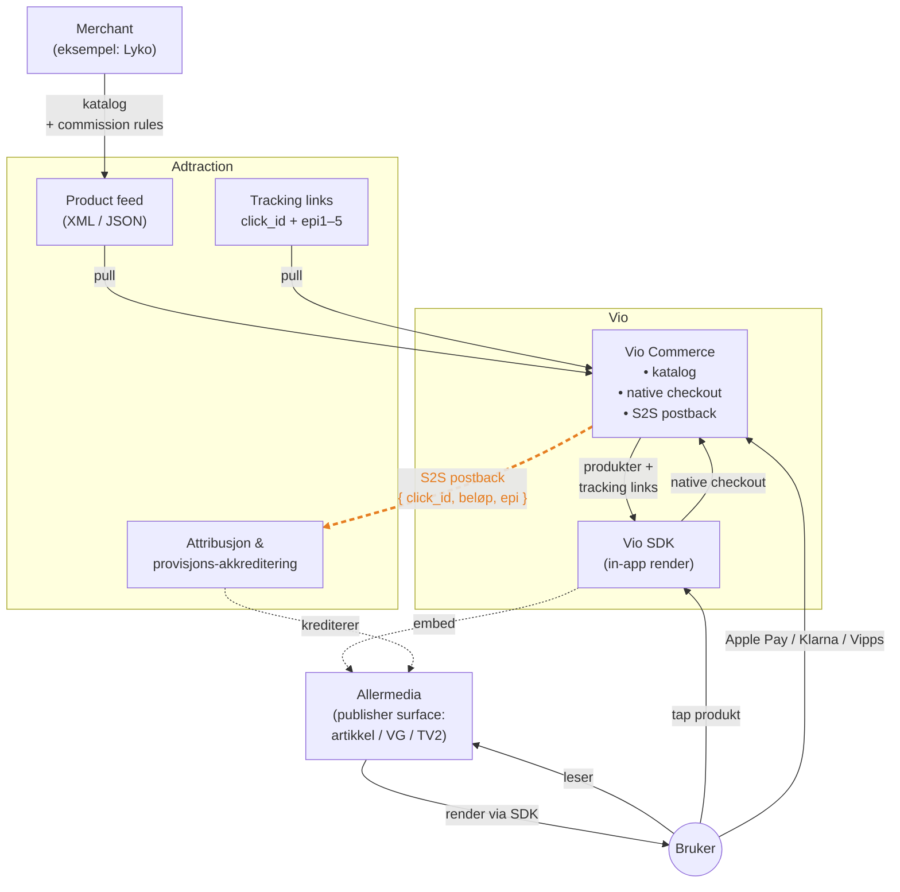
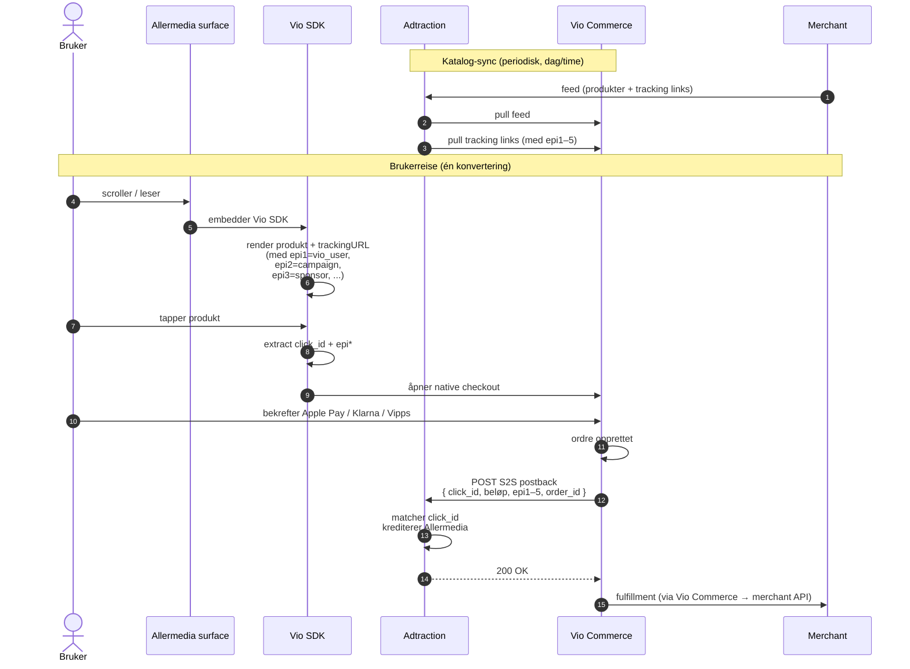
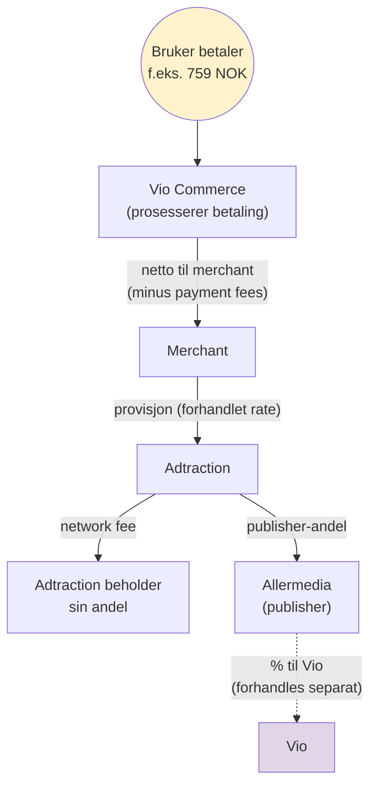

# Vio + Adtraction — pilot-arkitektur

## Oversikt

Vio er en **in-app shoppable surface** som rendrer produkter direkte inn i publisher-flater (artikler, video-overlay, brand-takeover, etc.) og avslutter kjøpet med **native checkout** via Vio Commerce — Apple Pay, Klarna, Vipps, kort — uten click-out til merchantens nettside.

For piloten vi ønsker å kjøre sammen med Allermedia og en av deres tre merchants i deres nettverk, foreslår vi å bruke Adtraction som **affiliate-skinnen** som lukker provisjons-loopen for publisher (Allermedia). Vio Commerce håndterer transaksjonen, Adtraction håndterer attribusjonen og publisher-utbetaling.

Dette dokumentet viser hvordan vi ser arkitekturen, slik at vi kan avstemme detaljene sammen.

---

## 1. Arkitektur — hvem snakker med hvem

> 🟠 **Den oransje, stiplede pilen** = S2S postback fra Vio Commerce til Adtraction. Dette er det tekniske integrasjonspunktet vi vil avstemme sammen med dere — se punkt A under "Punkter vi vil avstemme".

**Kort lest**: merchanten holder katalogen og kommisjonsregler i Adtraction (som de allerede gjør). Vio Commerce konsumerer feed-en og tracking-linkene deres. Vio SDK rendrer i publisher-flater og avslutter med native checkout. Når ordren er bekreftet, fyrer Vio Commerce en **server-to-server postback** til Adtraction med `click_id` og ordredata, slik at Adtraction kan kreditere riktig publisher.

---

## 2. Transaksjonsflyt — én konvertering fra ende til ende

**Kort lest**: brukeren ser produktet, tapper, gjør Apple Pay — alt skjer innenfor publisher-appen. I bakgrunnen fyrer Vio Commerce postbacken til Adtraction. Brukeren forlater aldri konteksten, og publisher krediteres deterministisk gjennom `click_id` (ingen cookies, ingen ITP-friksjon).

---

## 3. Provisjons-flyt (illustrativ)

Eksakt %-fordeling forhandles separat. Diagrammet illustrerer **strukturen** av pengestrømmen — én konvertering generer én provisjon fra merchant til Adtraction, som så fordeles til publisher (Allermedia), og en avtalt andel av publisher-andelen går til Vio.

---

## 4. Hva som allerede fungerer på Vios side

| Komponent | Status |
|---|---|
| In-app produktrendering (SDK + publisher surface) | 🟢 Produksjonsklar — TV2, VG kjører Vio surfaces i dag |
| Native checkout via Vio Commerce | 🟢 Produksjonsklar — Apple Pay verifisert end-to-end med 4 merchants i Norge |
| `click_id` propagation gjennom in-app flow (cookieless) | 🟢 Arkitekturklar — kan ta `click_id` + `epi1–5` fra Adtractions tracking links og bære dem server-side til konvertering |
| Multi-sponsor cart (en bruker kan handle fra flere merchants i samme kjøp) | 🟢 Produksjonsklar |
| Server-to-server postback-utløser fra Vio Commerce | 🟢 Vi kan implementere mot enhver dokumentert endpoint Adtraction eksponerer |

---

## 5. Punkter vi vil avstemme med dere

Disse er ikke "blockere" — vi vil bare bekrefte at vår forståelse av hvordan Adtraction-siden henger sammen er korrekt, slik at integrasjonen blir riktig fra første dag.

### A. S2S conversion postback for in-app native checkout

For en konvertering som skjer **server-side hos en partner** (Vio Commerce) i stedet for på merchantens nettside (der den vanlige conversion pixel ville fyre): hva er det anbefalte mønsteret for å rapportere konverteringen tilbake til Adtraction?

Spesifikt:
- Endpoint / URL vi skal POST-e til
- Payload-skjema (`click_id` + beløp + valuta + order_id + `epi1–5` + ...?)
- Autentisering (token, HMAC, shared secret)
- Idempotency-mekanisme (hva skjer hvis vi sender samme `order_id` to ganger?)
- Konfigureres dette per program eller globalt for publisher?

Vi har lett gjennom API v2 og v3 dokumentasjonen og fant ikke et eksplisitt endpoint for dette — vi antar det enten er konfigurert dashboard-side per program, eller dokumentert i et eget developer kit som ikke er publikt. Bekreft gjerne.

### B. EPI parameter-propagation

API v2 dokumenterer `epi`, `epi2`, `epi3`, `epi4`, `epi5` som publisher-definerte custom-felter som følger med click → konvertering. API v3 dokumenterer kun en `setEpi` boolean.

Spørsmål:
- Er `epi1–5` custom-feltene fra v2 fortsatt gyldige for programmer som er på v3-stacken?
- Eller har dere flyttet metadata-propagation til en annen mekanisme (URL-fragments, query params, custom headers)?

Dette er viktig for oss fordi vi trenger å bære Vio-spesifikk kontekst (sponsor_id, campaign_id, surface_type, ...) cookieless gjennom click → konvertering, slik at attribusjonen forblir deterministisk.

### C. Attribusjonsvindu

- Standard `cookieDuration` per program (typiske verdier for de tre merchantene vi har fått tilgang til)
- Bruker dere last-click, first-click eller tidsbasert attribusjon?
- Hvordan håndteres tilfeller der samme bruker treffer Vio surface på flere publishers innenfor attribusjonsvinduet?

### D. Sandbox / test-miljø

Eksisterer det et test-miljø der vi kan fyre konverteringer mot et test-program og verifisere at hele loopen lukkes (click_id matcher, publisher krediteres, `epi` overlever) før vi går live?

### E. Mismatch / edge cases

- Hvis vi fyrer en postback og `click_id` ikke matcher noen klikk på deres side (utløpt, ukjent), hva skjer? Logges det for manuell reconciliation, eller forkastes det stille?
- Hvis brukeren konverterer fra Vio surface men også har klikket et annet sted i nettverket innenfor attribusjonsvinduet, hvilken publisher får kreditten?

### F. Shopify-integrasjonen deres

Vi forstår at Adtractions Shopify-app håndterer katalog-sync + conversion pixel, men ikke order placement (det gjør Shopify selv).

I vårt mønster håndterer Vio Commerce order placement direkte (native in-app checkout), og fyrer S2S postback i stedet for å lene seg på en pixel på en thank-you page. Vi tolker dette som **komplementært** — vi okkuperer slot-en Shopify-appen ikke dekker. Bekreft gjerne at dette ikke overlapper med noe annet i deres tilbud.

---

## 6. Neste steg vi foreslår

1. **Kort teknisk avstemming** (30–45 min): vi går gjennom de seks punktene over med deres tekniske kontakt, og bekrefter postback-mønsteret slik at vi kan starte implementasjonen.
2. **Sandbox / staging-tilgang** for å verifisere loopen end-to-end før vi går live mot en av de tre tilgjengelige merchantene.
3. **Avstemming av kommersiell modell** (separat spor): %-fordeling av provisjon mellom Adtraction / Allermedia / Vio.
4. **Pilot kick-off** med en valgt merchant fra de tre tilgjengelige, i 2–3 ukers test-vindu før vi måler resultater og justerer.

Vi er klare til å starte teknisk integrasjon så snart vi har avstemt postback-mønsteret (punkt A over).

---

*Spørsmål eller kommentarer? Vi er glade for å gå gjennom dette i et møte eller per epost.*
